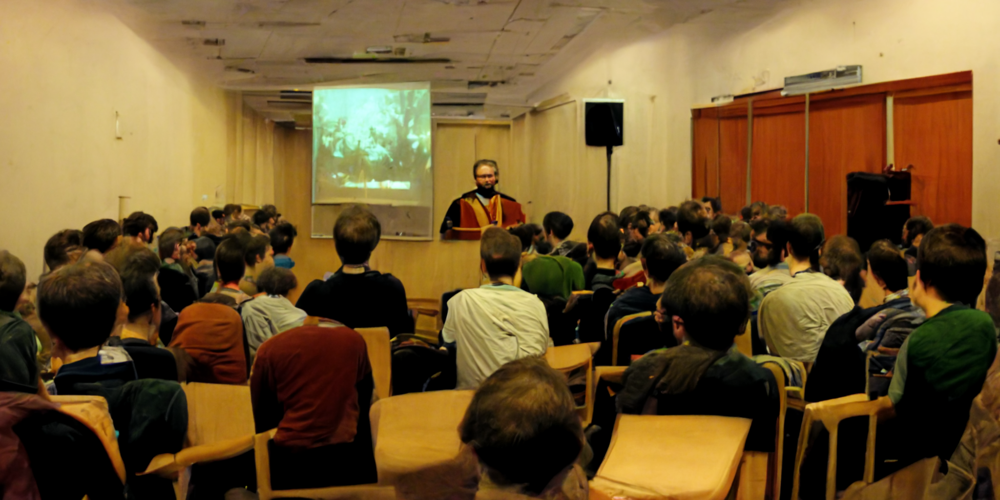

# 🎓 Slides

<!--Badges-->
<!--⚠️WARNING: This section was generated by https://github.com/hejny/batch-project-editor/blob/main/src/workflows/800-badges/badges.ts so every manual change will be overwritten.-->

<!---->

<!--/Badges-->

Presentations for [my](pavolhejny.com) [talks](talks.pavolhejny.com) on conferences and meetups.

<!--Wallpaper-->
<!--⚠️WARNING: This section was generated by https://github.com/hejny/batch-project-editor/blob/main/src//workflows/315-ai-generated-wallpaper/4-aiGeneratedWallpaperUseInReadme.ts so every manual change will be overwritten.-->

<!--/Wallpaper-->

<!--Contributing-->
<!--⚠️WARNING: This section was generated by https://github.com/hejny/batch-project-editor/blob/main/src/workflows/810-contributing/contributing.ts so every manual change will be overwritten.-->

## 🖋️ Contributing

I am open to pull requests, feedback, and suggestions. Or if you like this utility, you can [☕ buy me a coffee](https://www.buymeacoffee.com/hejny) or [donate via cryptocurrencies](https://github.com/hejny/hejny/blob/main/documents/crypto.md).

You can also ⭐ star the slides package, [follow me on GitHub](https://github.com/hejny) or [various other social networks](https://www.pavolhejny.com/contact/).

<!--/Contributing-->

<!--Partners-->
<!--⚠️WARNING: This section was generated by https://github.com/hejny/batch-project-editor/blob/main/src/workflows/820-partners/partners.ts so every manual change will be overwritten.-->

## ✨ Partners

[Become a partner](https://www.pavolhejny.com/contact/)

<!--/Partners-->